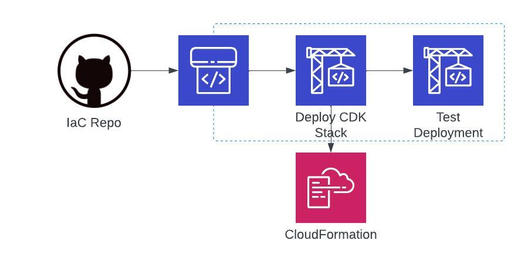
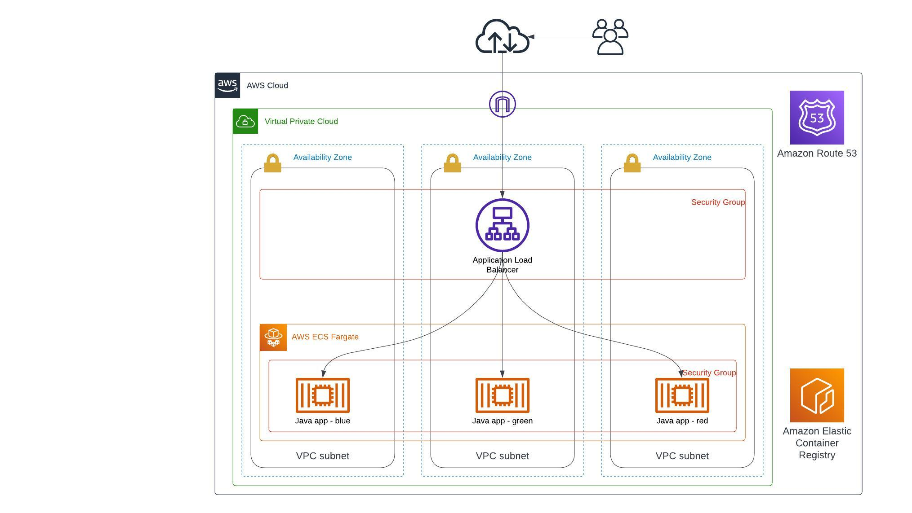

# aws-webinar-demo-gitops
Source code for AWS gitops webinar.

## Overview

In this project, we aim to create a Infra as Code (IaC) and Continues Deployment (CD) pipeline using Python CDK to demonstrate how to utilize GitOps practices in AWS. We will be deploying Demo Java application that is being managed in this GitHub repo: https://github.com/orbit-cloud-solutions/aws-webinar-demo-gitops-app. This project expects that the correct version of the applications are already present in AWS ECR repository. 

## Features

- IaC scripts for application deployment in cdk/ folder
- IaC scripts for CD deployment in cicd/ folder
- Application deployment configuration file 'config.json' in config/ folder
- Simple test script test.sh in test/ folder

## Installation

1. Deploy demo application as per instructions in: https://github.com/orbit-cloud-solutions/aws-webinar-demo-gitops-app
2. Clone this repository: `git clone https://github.com/orbit-cloud-solutions/aws-webinar-demo-gitops`
3. Install AWS CDK Python
4. Update config.json with your AWS account number and prefered AWS region
5. Manualy deployo CD part:
```
cd /cicd/cdk
cdk deploy
```
6. Go to AWS CodePipeline to see if the application deployment got triggered.
7. Application deployment to individual environments (dev, test, prod) are being configured in config.json. 

## Continues deployment pipeline(s)

There is one pipeline per environment. Each deployment pipeline gets triggere by a branch with matching name, i.e. dev, test, prod. If the branch doesn't exist then the corresponding pipeline fails. The pipeline deploys CDK from cdk/ folder.



## AWS Architecture Diagram

